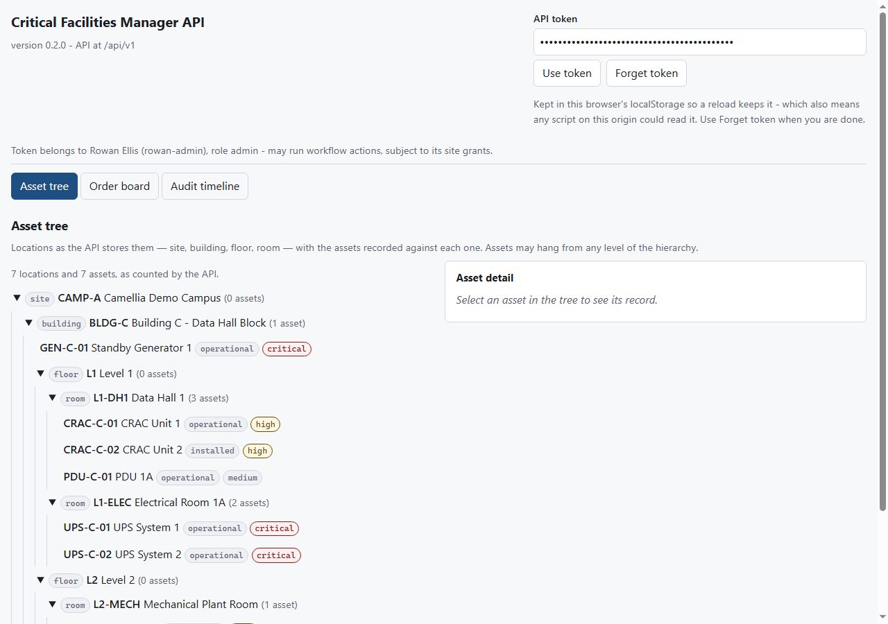
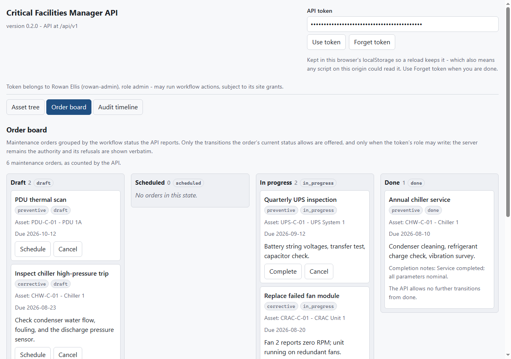
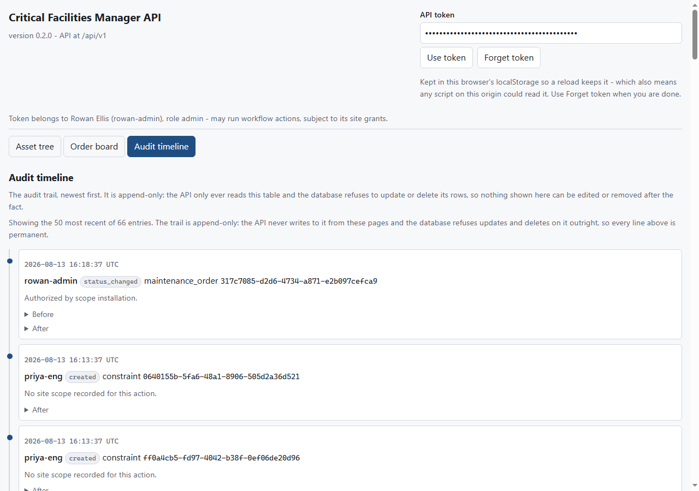

# Critical Facilities Manager

Operations platform for critical facilities (data centers and similar), built
as the operational counterpart to the validation and simulation projects in
this account. It carries the **domain core and the operational workflows
around it** — procedures, work permits, incidents, commissioning tests, punch
items, operational constraints — behind a token-authenticated, role-guarded,
versioned REST API, with a small web interface over that API. It is under
active development and interfaces may change without notice.

This project was developed and tested privately before its first public
release. The private history stays private; changes since then land in the
open, issue by issue.

**To operate the system rather than read about it, start with the
[User Manual](docs/user-guide/README.md)** — twenty chapters covering every
operation, the workflows that string them together, and what each refusal
means. **To install, configure, secure, back up, or upgrade an installation,
start with the
[Administrator and Deployment Guide](docs/admin-guide/README.md)** — seventeen
chapters covering every setting, the migration policy, evidence storage,
backups and restore, and the failure each of them produces. This README
describes what the platform is and how it is built.

## What exists today

- **Users, API tokens, and roles** — every request except `/health` carries
  an `Authorization: Bearer <token>` header. Tokens belong to users, are
  minted by an admin (or the bootstrap script), can expire, and can be
  revoked; the secret is generated server-side, shown exactly once at
  creation, and stored only as a SHA-256 hash that is compared in constant
  time on lookup. Failed authentications are throttled per network source
  and repeat offenders are locked out; a source the installation cannot
  verify — a request carrying an `X-Forwarded-For` header while no proxy is
  trusted — is not allowed its own counter, and shares one with every other
  such request (see
  [Rate limiting in production](docs/admin-guide/10-rate-limiting.md) and
  [Running behind a reverse proxy](docs/admin-guide/09-reverse-proxy.md)).
  Users have no passwords and cannot self-register — the web interface
  authenticates with the same bearer tokens the API does, so there is no
  session or password story to get wrong. Three roles: `viewer` reads
  everything, `engineer` additionally runs every domain workflow, and
  `admin` additionally manages users and tokens. The authenticated
  username is the actor recorded in the audit trail, which means the
  separation-of-duties rules (approver ≠ author, issuer ≠ requester,
  witness ≠ executor, verifier ≠ starter) compare authenticated
  identities, not header values.
- **Site-scoped authority, on reads as well as writes** — a user's role says
  *what* they may do; their site grants say *where*. A grant covers one site's
  whole subtree, or the whole installation (`site_id` null) — the default for
  new users, and what every user existing before migration `0002` was carried
  to, so behavior did not change for existing tokens. Every domain object
  resolves to its owning site (an order follows its asset, a permit its order,
  a punch item its asset or location, evidence whatever it is attached to): a
  write requires a covering grant, and a read is filtered to covered rows
  inside the query, so listings, their `total`, and direct fetches by id all
  stop at the grant boundary. An object outside it answers the same 404 a
  missing object answers — an id that exists out of scope is not
  distinguishable from one that never existed. No role bypasses this,
  `admin` included; installation-wide access is an installation-wide grant.
  Objects that belong to no single site — procedures, constraints, creating or
  deleting a site itself — require an installation-wide grant to write, stay
  readable to any authenticated user because the site-scoped work refers to
  them, and expose their site-owned parts (a constraint's member assets) only
  where grants cover them; their free text is not filtered. A refusal follows
  the same boundary as a read: a constraint blocking your order names the
  conflicting work only to a caller who could have read it. Scoped reads are a
  boundary over site-owned records, not tenant isolation — see
  [Known limitations](docs/user-guide/19-known-limitations.md). Moving an asset
  across sites requires authority over both. Every audit entry records the
  scope that covered the write
  (`installation` or `site:<id>`), and that stored label is what filters the
  trail on the way out, so history is never reinterpreted from an entity's
  current site.
- **Location hierarchy** — site → building → floor → room. The adjacency rule
  is enforced: each kind must hang from exactly the kind above it (a room
  cannot be attached directly to a building). Codes are unique among siblings.
- **Asset inventory** — free-text asset type, criticality
  (`low | medium | high | critical`), a location reference at any level of the
  hierarchy, and a tag that is unique within a site (the owning site is derived
  from the location and stored with the asset). Status follows an explicit
  state machine: `planned → installed → operational ⇄ under_maintenance`, with
  `decommissioned` reachable from `operational` and `under_maintenance`.
  Status changes only happen through the transition endpoint.
- **Maintenance orders** — preventive or corrective, always against one asset,
  with a due date. Workflow: `draft → scheduled → in_progress → done`, with
  `cancelled` reachable from any non-terminal state. Completing an order
  requires completion notes. Orders are editable only while draft or scheduled.
- **Procedures (MOP/SOP/EOP)** — a titled, ordered list of non-empty steps
  with a version lifecycle: `draft → approved → retired`. Steps and title are
  editable only while draft, and approval must come from a different actor
  than the author of the last draft edit. A new version of an approved
  procedure starts as a fresh draft linked to its predecessor; the chain stays
  linear (one successor per procedure) and is queryable from any member.
- **Work permits** — authorization to carry out a maintenance order that is
  scheduled or in progress, optionally under an approved procedure (draft and
  retired procedures are rejected). Workflow:
  `requested → issued → closed | revoked`. The issuer must differ from the
  requester, closing requires a completion note, and a maintenance order
  cannot be completed while one of its permits is still issued.
- **Incidents** — an unplanned event on an asset with a severity
  (`low | medium | high | critical`) and workflow
  `open → investigating → resolved | dismissed`; resolution notes are
  required to resolve. While the incident is active, a POST action creates a
  corrective maintenance order pre-filled from it (once per incident) and
  audit-links the two records in both directions.
- **Commissioning tests** — a planned acceptance test on an asset, optionally
  under an approved procedure, with workflow `pending → passed | failed`
  (both terminal). Recording a result stores the executing user and a
  witness that must be a different, active user. Evidence is a list of structured
  text notes (note, actor, UTC timestamp) appended while the test is pending
  or together with the result, plus file evidence (see
  [Evidence storage](docs/admin-guide/07-evidence-storage.md)). A failed test
  offers a POST action that opens a pre-filled punch item (once per test),
  audit-linked in both directions the same way incidents link their corrective
  orders.
- **Punch items** — a defect, missing element, documentation gap, or safety
  finding (`defect | missing | documentation | safety`) scoped to exactly
  one of an asset or a location, with a severity
  (`minor | major | blocking`) and an optional due date. Workflow:
  `open → in_progress → closed`, where closing requires a note and a
  verifier different from whoever started the work. The list filters by
  scope, category, severity, state, and overdue (due date past and not
  closed).
- **Operational constraints** — a named set of member assets, created and
  retired but never edited. The `mutual_exclusive_maintenance` kind (two or
  more members) is enforced when a maintenance order starts: if another
  member asset already has an order in progress, the start is rejected with
  a 409 problem naming the constraint, and the conflicting order too when the
  caller's grants would have let them read it. The
  `advisory` kind is free text attached to assets and is only surfaced,
  never enforced.
- **File evidence with content hashes** — files (photos, scans, signed
  sheets, reports) upload directly onto the commissioning test, punch item,
  maintenance order, or work permit they evidence. The content is hashed
  server-side while it streams in, stored write-once under its SHA-256, and
  re-verified on every download, so an audit can prove what was attached
  and that it has not changed (see
  [Evidence storage](docs/admin-guide/07-evidence-storage.md)).
- **Audit trail** — an append-only entry is written automatically for every
  create, update, delete, and state transition: who (the authenticated
  username), what (entity and action), when (UTC), and a before/after
  summary of the changed fields. Token secrets and hashes never appear in
  it. The API only ever reads this table, and the database itself refuses
  to change it: append-only is enforced by triggers on the audit and
  evidence tables, not just by application convention (see
  [Migrations](docs/admin-guide/04-migrations.md)).
- **A web interface** — the asset tree, the order board with its state
  actions, and the audit trail as a timeline, served by the application
  itself at `/ui` with no build step (see
  [Web interface](#web-interface)).
- **Problem-details errors** — every error body follows the RFC 9457 shape
  (see [Problem details](#problem-details)).
- **OpenAPI docs** — interactive documentation at `/docs` when enabled.
- **Migrated schema** — Alembic owns the database schema; the application
  refuses to start when the database is not at the head revision (see
  [Migrations](docs/admin-guide/04-migrations.md)).

## What does not exist yet

- Sessions and password login. Both the API and the web interface
  authenticate with bearer tokens; there is no session cookie, no password,
  and no SSO.
- Site-scoped administration. User, token, and grant management is gated by
  the admin role alone; an admin's own site grants scope their domain reads
  and writes, not whom they can manage.
- A commissioning witness beyond a validated reference — the scope check
  applies to the executor recording the result, not to the named witness.
- Cross-process rate limiting. The authentication throttle counts in
  process memory; with several workers each process enforces its own limit
  (see [Rate limiting in production](docs/admin-guide/10-rate-limiting.md)).
  A shared store — or limits at the reverse proxy — is future work for
  multi-worker deployments.
- Remote object storage. Evidence lives in a local directory behind a
  small store interface (write / verified read) so an S3-compatible
  backend can replace it without touching callers; that backend is future
  work, deliberately not built yet.
- Evidence retention and deletion. There is no delete endpoint — evidence
  is append-only like the audit trail, and the database enforces that with
  triggers — so how a real deployment handles retention periods, legal
  holds, or data-protection erasure requests is an open decision
  documented in
  [Retention and legal hold](docs/admin-guide/16-retention-and-legal-hold.md),
  not silently ignored. Until that design exists, any operational deletion
  takes a deliberate migration, on purpose.
- Editing in the web interface. It reads every domain object and runs the
  maintenance-order transitions; creating assets, procedures, permits, or
  incidents still goes through the API.

## Web interface

A small web interface ships with the application at `/ui` — plain HTML,
CSS, and ES modules served by the same process, with no build step and no
runtime dependency. It can be switched off for deployments that want the API
surface and nothing else (see
[The web interface](docs/admin-guide/08-web-interface.md)). It authenticates
with the same bearer token the API takes, entered once and kept in the
browser's `localStorage` (which the page says out loud, next to the button
that forgets it).

Three views:

**Asset tree** — locations as the API stores them, with the assets recorded
against each level and a detail panel for the selected one.



**Order board** — maintenance orders grouped by workflow status. Only the
transitions the order's current status allows are offered, and only when
the token's role may write. Site grants are deliberately not predicted:
the endpoint that lists them is admin-only, so a page holding an
engineer's token cannot know which sites that token covers. It offers the
action, attempts it, and shows the server's refusal verbatim — a 403
scope error kept visibly distinct from a 401, which is about the token
itself rather than about what the token may do.



**Audit timeline** — the trail newest first: actor, action, entity, the
scope the write was authorized under, and the before/after summary.



Nothing on these pages is invented: every value comes from a response, and
the two counts shown are the API's own totals. The tree and the board load
whole inventories by paging at the API's 200-row maximum, which suits this
system's scale rather than an installation with tens of thousands of
assets.

A headless Chromium loads these pages in CI against a seeded demo
database (`tests/test_browser_smoke.py`, the `Browser smoke (Chromium)`
job). It covers: each of the three views painting the figures the API
returned with nothing thrown and nothing logged as an error; a viewer
token being offered no action buttons and told why; a rejected token
producing the 401 banner; an action clicked on a card moving its order
between columns and appearing in the audit timeline; and the board's
columns laid out as columns rather than collapsed into one. It does not
check appearance — spacing, colour, and whether any of it looks good are
outside it — and it runs one browser engine, so a defect specific to
Firefox or Safari would pass. The tests need a browser binary and are
therefore left out of the default suite run:

```bash
python -m pip install -e ".[dev,browser]"
python -m playwright install chromium
python -m pytest -m browser
```

## Local development

Python 3.12 or newer is required.

```bash
python -m venv .venv
# Activate .venv with the command for your shell, then:
python -m pip install -e ".[dev]"
python -m pytest
python scripts/bootstrap_admin.py your-admin-name  # first run only; prints the admin token once
uvicorn cfm.main:app --reload
```

The bootstrap script refuses to run once any user exists; from then on,
users and tokens are managed through the API with an admin token.

Quality gates, run the same way as CI:

```bash
ruff format --check .
ruff check .
mypy
python -m pytest
```

CI additionally gates test coverage, runs the migration chain and the
full suite against a real PostgreSQL server (set `CFM_TEST_DATABASE_URL`
to a PostgreSQL URL to do the same locally), and loads the web pages in a
headless browser (see [Web interface](#web-interface)); day-to-day local
runs stay on SQLite for speed.

## Operating an installation

Installing, configuring, migrating, securing, backing up, restoring, and
upgrading a deployment are covered chapter by chapter in the
[Administrator and Deployment Guide](docs/admin-guide/README.md).

## Demo dataset

Seed a small fictional campus (one site, one building, floors, rooms, seven
assets, maintenance orders in different workflow states, procedures with a
version chain, an issued work permit, incidents — one linked to a corrective
order — commissioning tests with witnessed evidence including a failed one
linked to its punch item, an overdue blocking punch item, and constraints
over the redundant UPS pair and the CRAC units) so the API is explorable
immediately:

```bash
python scripts/seed_demo.py
uvicorn cfm.main:app --reload
# then browse http://localhost:8000/docs
```

The seed also creates a synthetic crew — one admin, two engineers, one
viewer — and runs every workflow action as one of them, so the audit trail
shows real actors. One API token per crew member is minted during seeding
and printed exactly once (only hashes are stored); `cfm.demo.seed_demo`
returns the same secrets programmatically, which is how the test suite
reaches the seeded API deterministically.

All demo data is synthetic. The script refuses to run against a database that
already contains locations or users.

## API

All routes live under `/api/v1`. Except `/health`, every request must send
`Authorization: Bearer <token>`. Any authenticated user may issue GET
requests; everything else requires the engineer or admin role, and the
`/users` rows below require admin outright. Site grants then decide where
that authority reaches: a domain write requires a grant covering the
target's site — an installation-wide grant for procedures, constraints, and
sites themselves — and a domain read returns, counts, and fetches only what
those grants cover, answering 404 for anything else (see the site-scoped
authority bullet above). List endpoints return
`{items, total, limit, offset}` and accept `limit` and `offset` query
parameters; `total` counts the rows the caller may read.

| Method | Path | Purpose |
| --- | --- | --- |
| GET | `/health` | Liveness and database check (no auth) |
| GET | `/me` | The authenticated caller's own user |
| POST | `/users` | Create a user, optionally scoped to sites via `site_ids` (admin) |
| GET | `/users` | List users (`role`, `is_active` filters; admin) |
| GET | `/users/{id}` | Fetch one user (admin) |
| POST | `/users/{id}/deactivate` | Deactivate a user; the last active admin is protected (admin) |
| POST | `/users/{id}/tokens` | Mint an API token; the secret appears once (admin) |
| GET | `/users/{id}/tokens` | List token metadata — never secrets (admin) |
| POST | `/users/{id}/tokens/{token_id}/revoke` | Revoke a token (admin) |
| GET | `/users/{id}/site-grants` | List a user's site grants (admin) |
| POST | `/users/{id}/site-grants` | Grant write authority on a site, or installation-wide with a null `site_id` (admin) |
| DELETE | `/users/{id}/site-grants/{grant_id}` | Delete a grant; authority narrows immediately (admin) |
| POST | `/locations` | Create a location |
| GET | `/locations` | List locations (`kind`, `parent_id` filters) |
| GET | `/locations/{id}` | Fetch one location |
| PATCH | `/locations/{id}` | Rename or recode a location |
| DELETE | `/locations/{id}` | Delete a childless, asset-free location no grant references |
| POST | `/assets` | Create an asset |
| GET | `/assets` | List assets (`location_id`, `site_id`, `status`, `criticality` filters) |
| GET | `/assets/{id}` | Fetch one asset |
| PATCH | `/assets/{id}` | Update asset fields (not status) |
| POST | `/assets/{id}/transition` | Change asset status (validated) |
| POST | `/maintenance-orders` | Create an order (starts as draft) |
| GET | `/maintenance-orders` | List orders (`asset_id`, `status`, `order_type` filters) |
| GET | `/maintenance-orders/{id}` | Fetch one order |
| PATCH | `/maintenance-orders/{id}` | Edit a draft or scheduled order |
| POST | `/maintenance-orders/{id}/schedule` | draft → scheduled |
| POST | `/maintenance-orders/{id}/start` | scheduled → in_progress |
| POST | `/maintenance-orders/{id}/complete` | in_progress → done (notes required) |
| POST | `/maintenance-orders/{id}/cancel` | any active state → cancelled |
| POST | `/maintenance-orders/{id}/evidence-files` | Upload and attach a file as evidence (multipart) |
| GET | `/maintenance-orders/{id}/evidence-files` | List the order's file evidence |
| POST | `/procedures` | Create a procedure (starts as draft, version 1) |
| GET | `/procedures` | List procedures (`kind`, `status` filters) |
| GET | `/procedures/{id}` | Fetch one procedure |
| GET | `/procedures/{id}/versions` | Full version chain, oldest first |
| PATCH | `/procedures/{id}` | Edit title or steps of a draft |
| POST | `/procedures/{id}/approve` | draft → approved (distinct approver) |
| POST | `/procedures/{id}/retire` | approved → retired |
| POST | `/procedures/{id}/new-version` | New linked draft of an approved procedure |
| POST | `/work-permits` | Request a permit for an active order |
| GET | `/work-permits` | List permits (`order_id`, `status` filters) |
| GET | `/work-permits/{id}` | Fetch one permit |
| POST | `/work-permits/{id}/issue` | requested → issued (distinct issuer) |
| POST | `/work-permits/{id}/close` | issued → closed (note required) |
| POST | `/work-permits/{id}/revoke` | issued → revoked |
| POST | `/work-permits/{id}/evidence-files` | Upload and attach a file as evidence (multipart) |
| GET | `/work-permits/{id}/evidence-files` | List the permit's file evidence |
| POST | `/incidents` | Report an incident (starts as open) |
| GET | `/incidents` | List incidents (`asset_id`, `severity`, `status` filters) |
| GET | `/incidents/{id}` | Fetch one incident |
| POST | `/incidents/{id}/start-investigation` | open → investigating |
| POST | `/incidents/{id}/resolve` | investigating → resolved (notes required) |
| POST | `/incidents/{id}/dismiss` | investigating → dismissed |
| POST | `/incidents/{id}/corrective-order` | Create a linked corrective order |
| POST | `/commissioning-tests` | Plan a test for an asset (starts pending) |
| GET | `/commissioning-tests` | List tests (`asset_id`, `status` filters) |
| GET | `/commissioning-tests/{id}` | Fetch one test with its evidence |
| POST | `/commissioning-tests/{id}/evidence` | Append a text evidence note (pending only) |
| POST | `/commissioning-tests/{id}/pass` | pending → passed (distinct witness) |
| POST | `/commissioning-tests/{id}/fail` | pending → failed (distinct witness) |
| POST | `/commissioning-tests/{id}/punch-item` | Open a linked punch item from a failed test |
| POST | `/commissioning-tests/{id}/evidence-files` | Upload and attach a file as evidence (multipart) |
| GET | `/commissioning-tests/{id}/evidence-files` | List the test's file evidence |
| POST | `/punch-items` | Record a punch item (asset or location scope) |
| GET | `/punch-items` | List punch items (`asset_id`, `location_id`, `category`, `severity`, `status`, `overdue` filters) |
| GET | `/punch-items/{id}` | Fetch one punch item |
| POST | `/punch-items/{id}/start` | open → in_progress |
| POST | `/punch-items/{id}/close` | in_progress → closed (distinct verifier, note required) |
| POST | `/punch-items/{id}/evidence-files` | Upload and attach a file as evidence (multipart) |
| GET | `/punch-items/{id}/evidence-files` | List the punch item's file evidence |
| POST | `/constraints` | Create a constraint over member assets |
| GET | `/constraints` | List constraints (`kind`, `status`, `asset_id` filters) |
| GET | `/constraints/{id}` | Fetch one constraint |
| POST | `/constraints/{id}/retire` | active → retired |
| GET | `/evidence-objects/{id}` | Fetch one evidence object's metadata (hash, size, declaration) |
| GET | `/evidence-objects/{id}/content` | Download the bytes, re-verified against the recorded hash |
| GET | `/audit-entries` | Read the audit trail (`entity_type`, `entity_id`, `actor` filters) |

## Problem details

Errors use `application/problem+json` with this shape:

```json
{
  "type": "https://github.com/NishikawaButterfly/critical-facilities-manager#problem-details",
  "title": "Request conflicts with current state",
  "status": 409,
  "detail": "Asset status cannot change from 'planned' to 'operational'; allowed: installed.",
  "instance": "/api/v1/assets/…/transition",
  "error_code": "asset.invalid_transition"
}
```

Validation failures (`422`, `error_code: api.validation_failed`) additionally
carry `invalid_params`, a list of `{name, reason}` objects.

Authentication failures return `401` with a `WWW-Authenticate: Bearer`
header and either `auth.credentials_required` (no usable header) or
`auth.invalid_token` — the latter is deliberately vague so responses do not
reveal whether a token exists, is revoked, or has expired. A source that
keeps failing authentication receives `429` with `auth.rate_limited`, a
`Retry-After` header, and a body that is identical whatever token was
presented (see
[Rate limiting in production](docs/admin-guide/10-rate-limiting.md)). Role
failures return `403` with `auth.forbidden`; a write whose target site no
grant covers returns `403` with `auth.scope_forbidden`.

## License

[MIT](LICENSE)
